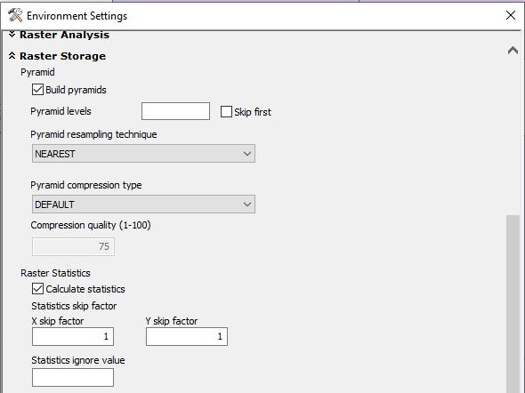
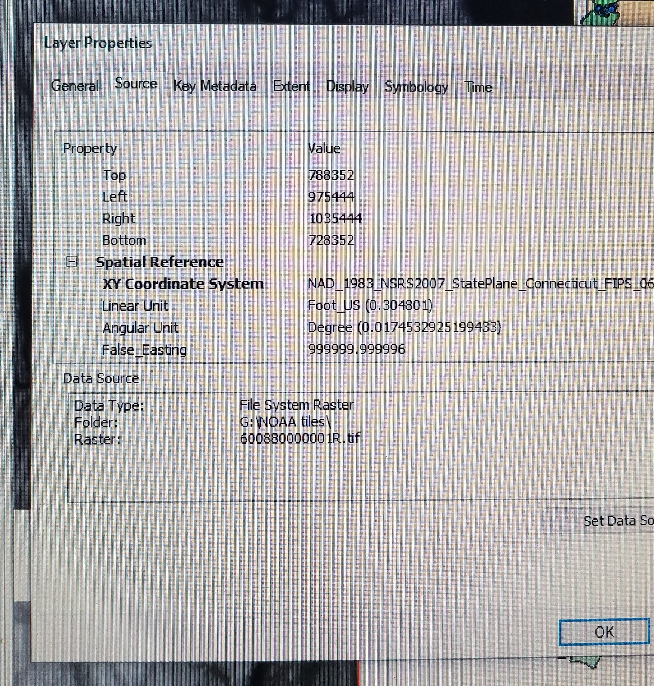

I recently finished up a seasonal position with a state agency, and during my time I was tasked with helping my supervisor with a research project involving Geographic Information System (GIS). GIS can be a tricky software, even for someone like myself who has had previous experience using it for other past projects. For this particular project, I downloaded digital elevation models (DEMs) from a dataset available for use online that covered areas maintained by hundreds of study plots. This data was then resampled (changing the cell size/resolution) and mosaicked (combining multiple images to create one seamless image) in ArcMap, so I could clip them using a separate file of drainage basin polygons as my chosen extent. These clipped outputs were then used to begin constructing a series of topographic wetness indexes using the open-source System for Automated Geoscientific Analyses software (SAGA GIS).

There were several trial and errors throughout this project, but luckily, I had some GIS enthusiasts who were more than happy to share their tips and advice. Here is a list of some of those helpful hints I learned along the way that were specific to the project, along with just some things to keep in mind when using GIS.

<h2> Know what you need in order to complete your GIS workflow </h2>
	This may sound obvious, but sometimes it’s not always clear what roadblocks are in your way until you’re actually knee-deep in the project. Or at least, this is what happened to me. At the start of the project, I already had a pretty clear idea of what needed to be done, and the tools I would need to complete each step. However, I was only working with a Basic ArcMap license, which meant that certain mechanics that would have saved quite a bit of time and headache – like having the ability to construct a mosaic dataset – were not at my disposal. I was still able to do what needed to be done using other tools I had access to, but the entire process was a lot more arduous. time consuming, and repetitive.
	This goes along with another similar point that I needed to keep reminding myself:

<h2> Know your limitations </h2>
Maybe, like myself, you could not obtain a more advanced ArcMap license. Maybe you don’t have access to ArcMap so you’re using QGIS (an open-source GIS software) instead. Maybe you’re not a big coder, so it’s harder for you to combine GIS with a programming language to speed up your processing. Or maybe, you spent the first two months of your project working on a ten-year old, 32-bit processing brick that would crash multiple times a day, so you hardly got any work done, because there was not a better, newer machine available for you to use (ahem). The point is, I needed to remind myself that I shouldn’t shoulder the blame for something that was outside of my control. And neither should you.

<h2> Check to see if your statistics are calculated for your elevation data </h2>
In the early stages of my project, I was working with QGIS. Once I was able to obtain access to ArcMap, I switched to using ArcMap exclusively for the rest of the project. When I imported my first DEM tile into my ArcMap project, the minimum and maximum elevation values were vastly different from what they had been in QGIS. I quickly realized that the tile’s statistics for some reason had not been automatically calculated in ArcMap like they had been in QGIS. This is a pretty simple thing, but it wasn’t something I’d come across before, as most of the data I worked with in the past usually automatically had their statistics calculated. If you right-click your data and go to Properties, you can scroll down and see whether or not any statistics are calculated. This is a fairly easy thing to rectify, using the Calculate Statistics tool. Or, you can calculate the statistics for the output of a tool you’re using by going into the Environment Settings. I kept the skip factor as 1, and was encouraged to set the Ignore Value parameter to whatever my tile’s NoData value was (in this case it was -999999).

<em>The checkbox for the Calculate Statistics box is filled, indicating they will be calculated for the tool’s output raster </em>

<h2> If it can be avoided, do not change the coordinate system of your elevation data </h2>
One of the first steps of any mapping assignment is to verify that your coordinate system is consistent for all your data. This includes making sure the coordinate system of the data frame matches as well. When I first started the project, I selected one of my tiles to be my first layer, so that the data frame’s coordinate system matched that of the tile’s. I was encouraged to not reproject the coordinate system of my DEM tiles, but instead simply reproject my vector data to match the projected coordinate system of my DEM tiles. This is because reprojecting elevation data could be made more difficult due to their z value i.e. the vertical/elevation unit. The reason for this is because if the elevation data is reprojected to a coordinate system with different units, you would need to be sure you convert the z values units as well, otherwise you risk creating inaccurate results. Which brings me to my next point:

<h2> Keep track of the units of your z-value </h2>
The units of your elevation data’s z value may not necessarily match the units of the x and y values. For instance, the x and y – or linear – units may be in feet, but the z value could be in meters (I don’t know why this happens sometimes with elevation data. But considering one of the people I frequently contacted for GIS tips also did not know why, I don’t feel so bad). I was encouraged to make sure that when I downloaded my DEM tiles, they were in a coordinate system with matching units for their x, y, and z values. The units may be listed under the Properties tab. If not, check the metadata.

<em>Under the Properties, you can see the projected coordinate system of an elevation tile, with the listed horizontal linear unit</em>

<h2> Use the correct Resample method </h2>
As I mentioned earlier, resampling geospatial data refers to changing the cell size, or resolution, of the data. The resample method employed will change based on the kind of data you are using. For continuous data, like elevation data, you want to use either the Bilinear or the Cubic Convolution methods.

<h2> Keep rasters aligned </h2>
The dataset I used for my analysis was available for download in tile sections from NOAA’s Data Access Viewer. Because they all came from the same dataset, the tiles were probably all aligned to each other at the start. But to be safe, I was encouraged to use the Snap Raster under the Environment Settings. I resampled my first tile without using the Snap Raster, then set that tile output as the Snap Raster for every other tile that I resampled after that.

<h2> Selecting your mosaic tool </h2>
A mosaic, as stated earlier, is when you create a single image from a series of images. ArcMap has two tools that can be used for creating mosaics: the Mosaic tool, and the Mosaic to New Raster tool. The Mosaic to New Raster tool creates a new output, while the Mosaic tool alters the target raster by combining it with the input rasters. The Mosaic tool also has more parameter options for the NoData and background values. I tested out the Mosaic to New Raster tool, but in the end decided to stick with the Mosaic tool. I used the Copy Raster tool to make a raster copy of one of my resampled tiles. That tile was then used as the target raster, so I could combine it with my resampled inputs. Because these DEM tiles originated from the same dataset, overlapping may have been a non-issue. But to be safe, it was suggested I use the Mean mosaic type, thereby instructing the tool to take the average pixel value for any overlapping cells.

<em>Example of DEM tiles, underneath my drainage basins (in pink) layer and datapoint layer</em>

<em>Example of a mosaic of the DEM tiles</em>

<h2> When in doubt, ask questions </h2>
Yes, this is extremely common advice. But if you’re battling imposter syndrome, or worried your question is very obvious, asking for help can be really hard. There were many instances when I debated whether or not I should send off yet another email to a colleague asking about a specific tool or parameter, wondering how long I would allow myself to try Googling for a satisfactory answer before I gave up and asked someone for help. I’ve taken classes on GIS, but it is extremely unrealistic for me to believe that I should know everything there is to know about this software. And I much preferred asking a potentially simple question rather than push forward and risk doing something I’d need to go back and redo later just because I was too afraid to ask for help.
Side note, if you ask more than one person the same GIS-related question, be prepared for the possibility of receiving entirely different answers. I once emailed the same question to two different people from two different agencies, and I received two different responses. Rather than frustrate me, I found this strangely reassuring. It just proves that GIS is a complicated software, and not everyone has all of the answers. Just like me.

Overall, this was a challenging project. Aside from technical limitations, I was left feeling stressed and anxious more times than I’d like to admit. But in the end, I still had a fresh experience under my belt, some new contacts, and a wider GIS skillset that’ll benefit me as I move forward in my environmental career. That’s why I decided to put this list together. Even though many of these GIS tips are extremely basic, perhaps they’ll still benefit someone else out there. But I also wanted to create this list to remind myself that no matter how hard things got, no matter how many times I sat at my computer questioning what I was doing, I still accomplished a lot.

If you want to try processing your own elevation data, you can visit NOAA’s Data Access Viewer, where you can download land cover, elevation, or imagery data:
https://coast.noaa.gov/dataviewer/#/

Many states also have their own GIS libraries. The drainage basin shapefile I used came from Connecticut’s Department of Energy and Environmental Protection’s GIS library:
https://ct-deep-gis-open-data-website-ctdeep.hub.arcgis.com/

For basic information regarding GIS tools, ESRI is usually a pretty good place to start. Here is a page explaining what a mosaic is:
https://desktop.arcgis.com/en/arcmap/10.3/manage-data/raster-and-images/what-is-a-mosaic.htm

